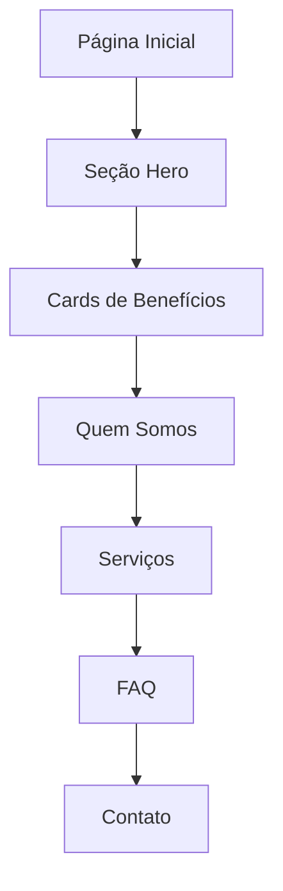

# Documento de Requisitos do Produto - Site E5 Inovação

## 1. Visão Geral do Produto

O site da E5 Inovação é uma plataforma digital profissional que apresenta soluções de automação e assistentes de IA para empresas, focando em eficiência operacional e redução de custos. O site serve como vitrine dos serviços da empresa e canal de captação de leads qualificados.

## 2. Funcionalidades Principais

### 2.1 Módulos de Páginas

Nosso site consiste nas seguintes páginas principais:
1. **Página Inicial**: header com navegação, seção hero, cards de benefícios, seção quem somos, seção de serviços, FAQ e footer.

### 2.2 Detalhes das Páginas

| Nome da Página | Nome do Módulo | Descrição da Funcionalidade |
|----------------|----------------|------------------------------|
| Página Inicial | Header | Exibir logo E5 Inovação, menu de navegação (Quem somos, Serviços) e botão "Entrar em contato" |
| Página Inicial | Seção Hero | Apresentar título principal "Inovação em Processos, Assistentes de IA", subtítulo "eficiência 5.0" e elementos visuais impactantes |
| Página Inicial | Cards de Benefícios | Mostrar três cards destacando "30% há menos CUSTO", "40% há menos TEMPO" e "30% de ganho" |
| Página Inicial | Seção Quem Somos | Apresentar texto "Bem-vindo há E5 Inovação! Somos uma empresa que nasce com a paixão por eficiência, acreditamos em processos fluidos e simples" com área para conteúdo adicional |
| Página Inicial | Seção de Serviços | Exibir grid de 6 cards de serviços: SDR Pré-Vendas, SDR Agendamento, SDR Suporte, Consultório médico, Consultório Odontológico, Fale com um especialista |
| Página Inicial | FAQ | Implementar seção de perguntas frequentes com funcionalidade expansível/retrátil |
| Página Inicial | Footer | Mostrar links de navegação, informações de contato, logo da empresa e direitos reservados |

## 3. Processo Principal

O fluxo principal do usuário consiste em:
1. Acessar a página inicial
2. Visualizar os benefícios e serviços oferecidos
3. Conhecer mais sobre a empresa na seção "Quem somos"
4. Explorar os serviços disponíveis
5. Esclarecer dúvidas no FAQ
6. Entrar em contato através dos botões de call-to-action

## 4. Design da Interface do Usuário

### 4.1 Estilo de Design

- **Cores primárias**: Azul profissional (#1e3a8a), branco (#ffffff)
- **Cores secundárias**: Gradientes suaves, tons de cinza para textos
- **Estilo dos botões**: Arredondados com gradientes, efeitos hover
- **Tipografia**: Fonte moderna e limpa, tamanhos hierárquicos (32px para títulos, 18px para textos)
- **Layout**: Design baseado em cards, navegação superior fixa
- **Ícones**: Estilo minimalista e profissional, relacionados à tecnologia e IA

### 4.2 Visão Geral do Design das Páginas

| Nome da Página | Nome do Módulo | Elementos da UI |
|----------------|----------------|------------------|
| Página Inicial | Header | Navbar fixa, logo à esquerda, menu centralizado, botão CTA à direita com destaque |
| Página Inicial | Seção Hero | Background gradiente, título em destaque, subtítulo, elementos visuais de tecnologia |
| Página Inicial | Cards de Benefícios | Grid de 3 cards com ícones, números em destaque, bordas arredondadas |
| Página Inicial | Quem Somos | Layout duas colunas, texto à esquerda, área visual à direita |
| Página Inicial | Serviços | Grid responsivo 3x2, cards com hover effects, ícones representativos |
| Página Inicial | FAQ | Lista vertical, botões expansíveis com ícones +/-, animações suaves |
| Página Inicial | Footer | Layout multi-coluna, links organizados, informações de contato, logo |

### 4.3 Responsividade

O site é mobile-first com adaptação para desktop, incluindo otimização para interações touch em dispositivos móveis. Breakpoints principais: 768px (tablet) e 1024px (desktop).