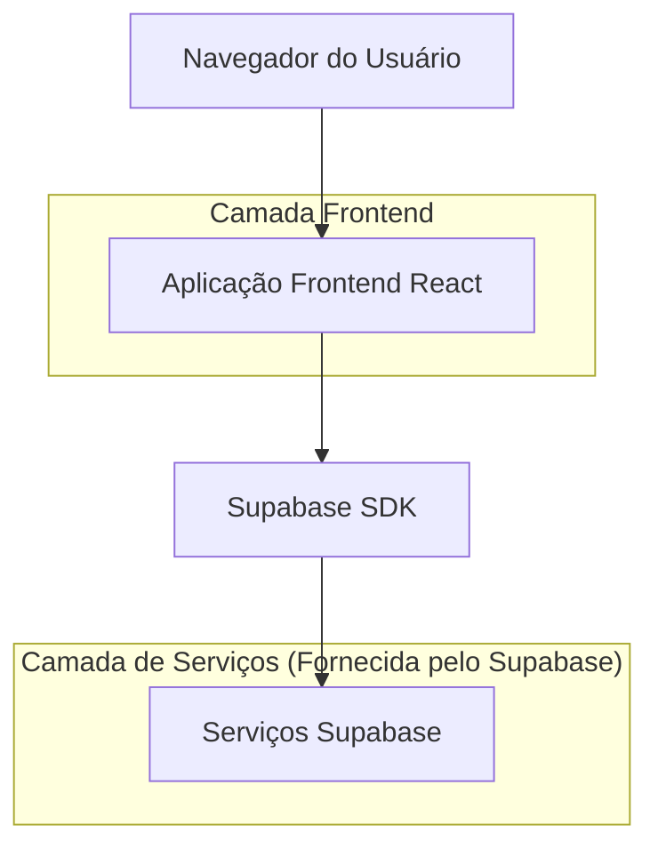
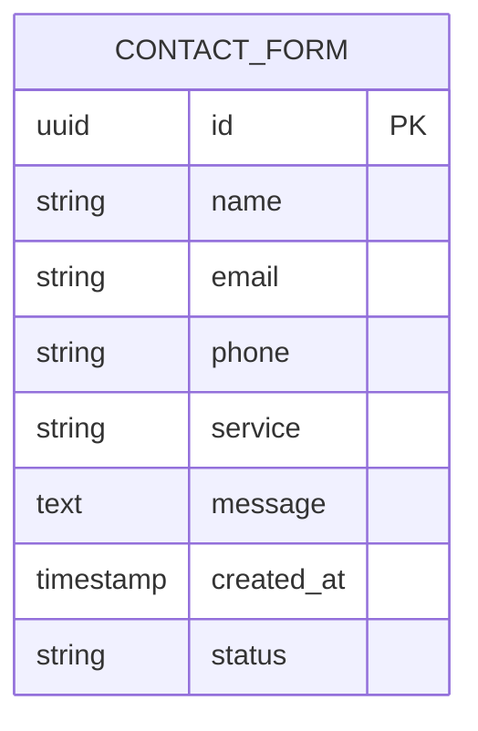

# Documento de Arquitetura Técnica - Site E5 Inovação

## 1. Design da Arquitetura



## 2. Descrição das Tecnologias

* Frontend: React\@18 + TailwindCSS\@3 + Vite

* Backend: Supabase (para formulários de contato e analytics)

## 3. Definições de Rotas

| Rota         | Propósito                                               |
| ------------ | ------------------------------------------------------- |
| /            | Página inicial, exibe todo o conteúdo principal do site |
| /#quem-somos | Âncora para a seção "Quem Somos"                        |
| /#servicos   | Âncora para a seção "Serviços"                          |
| /#contato    | Âncora para a seção de contato                          |

## 4. Definições de API

### 4.1 API Principal

Formulário de contato

```
POST /api/contact
```

Request:

| Nome do Parâmetro | Tipo do Parâmetro | Obrigatório | Descrição                 |
| ----------------- | ----------------- | ----------- | ------------------------- |
| name              | string            | true        | Nome completo do usuário  |
| email             | string            | true        | Email válido para contato |
| phone             | string            | false       | Telefone para contato     |
| service           | string            | true        | Serviço de interesse      |
| message           | string            | true        | Mensagem detalhada        |

Response:

| Nome do Parâmetro | Tipo do Parâmetro | Descrição               |
| ----------------- | ----------------- | ----------------------- |
| success           | boolean           | Status da operação      |
| message           | string            | Mensagem de confirmação |

Exemplo:

```json
{
  "name": "João Silva",
  "email": "joao@empresa.com",
  "phone": "(11) 99999-9999",
  "service": "SDR Pré-Vendas",
  "message": "Gostaria de saber mais sobre os serviços de automação."
}
```

## 5. Modelo de Dados

### 5.1 Definição do Modelo de Dados



### 5.2 Linguagem de Definição de Dados

Tabela de Formulários de Contato (contact\_forms)

```sql
-- criar tabela
CREATE TABLE contact_forms (
    id UUID PRIMARY KEY DEFAULT gen_random_uuid(),
    name VARCHAR(255) NOT NULL,
    email VARCHAR(255) NOT NULL,
    phone VARCHAR(20),
    service VARCHAR(100) NOT NULL,
    message TEXT NOT NULL,
    status VARCHAR(20) DEFAULT 'pending' CHECK (status IN ('pending', 'contacted', 'closed')),
    created_at TIMESTAMP WITH TIME ZONE DEFAULT NOW()
);

-- criar índices
CREATE INDEX idx_contact_forms_created_at ON contact_forms(created_at DESC);
CREATE INDEX idx_contact_forms_status ON contact_forms(status);
CREATE INDEX idx_contact_forms_service ON contact_forms(service);

-- permissões
GRANT SELECT ON contact_forms TO anon;
GRANT ALL PRIVILEGES ON contact_forms TO authenticated;
```

